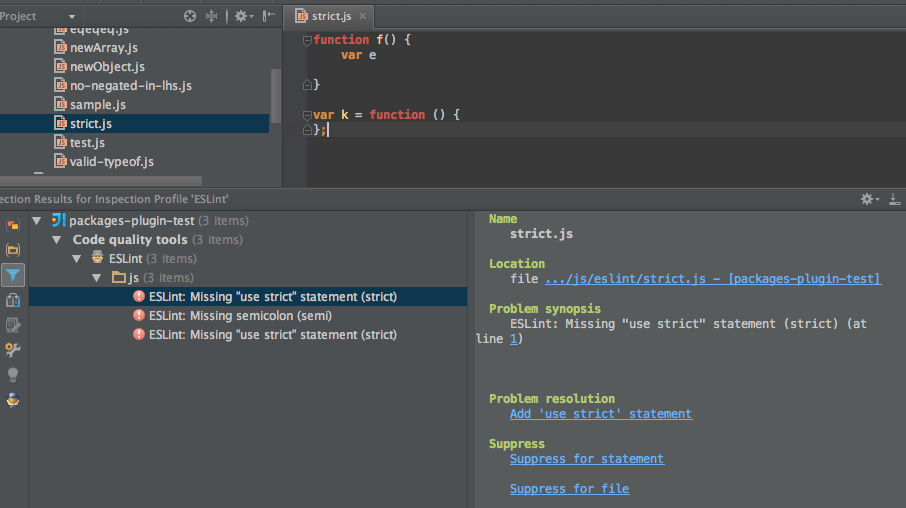

## The Importance of Coding Standards

When it comes to coding standards, everyone has their own opinion. Some wonder if these rules and guidelines truly help us write better code. In my personal view, coding standards may not directly improve the functionality of our code, but 
they play a crucial role in making our code look presentable and easy to understand. This is important for several reasons. Think of it like decorating a delicious meal at a restaurant; even though the taste matters most, the presentation 
enhances the overall experience.

Coding standards are akin to a set of guidelines that instruct us on how to write our code neatly and consistently. While they might not make our code work better, they make it significantly easier to read and work with. Here are some key 
reasons why coding standards matter. Coding standards serve multiple essential purposes in software development. Firstly, they significantly enhance code readability, creating an experience similar to reading a well-structured book where 
everything makes sense, thereby easing bug fixes and troubleshooting. Secondly, in collaborative projects, adherence to coding standards ensures that everyone speaks the same coding language, promoting seamless understanding and teamwork 
among developers. Additionally, coding standards act as a shield against errors, offering clear rules for variable naming and code formatting, reducing the likelihood of small mistakes causing significant issues. Lastly, they serve as 
valuable learning tools, similar to following a recipe to master cooking, aiding in understanding programming languages' grammar and vocabulary, ultimately cultivating more skilled coders.

During my initial week of utilizing ESLint in collaboration with IntelliJ, I encountered a few challenges. ESLint functions as an assistant, verifying if your code aligns with the coding standards. When you achieve that green checkmark, it 
symbolizes that you are effectively following the rules. However, attaining this green checkmark can prove to be quite demanding. ESLint's strict nature, along with its somewhat tedious setup process, can be a bit of a frustration. 
Personally, I had mixed feelings about the setup since it involves downloading multiple files, which I found to be a bit tedious. Nevertheless, despite the setup inconveniences, the core purpose of ESLint as a valuable coding aid shines 
through, simplifying the coding process and enhancing code quality when used effectively.

Coding standards certainly have an indirect impact on code quality; though the code still runs, following coding standards makes it significantly easier to write the code and detect issues. It might help to insert a picture, perhaps of 
ESLint highlighting violations of our coding standards. We will go over a more convenient means of handling the sample.* files later in the semester.

