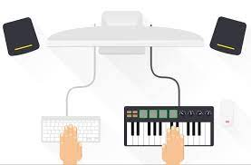

 

### Personal Experience
In my coding adventures, I like to think of each project as a musical composition, with design patterns serving as the musical notes 
that guide me in creating software that's not only functional but also elegant. These patterns are like familiar tunes, proven 
solutions that ensure efficiency and harmony in the code. I've applied design patterns, like the Observer and Bridge patterns, in 
projects such as my ICS 314 final assignment, where they acted as guiding principles, much like orchestrating a symphony. 
The Observer pattern helped different components work together smoothly, like instruments syncing with a conductor, while the Bridge 
pattern created a coherent link, similar to a musical bridge, connecting different elements for seamless data exchange. Another 
example is the Decorator pattern in a data validation module, allowing for dynamic extension of behavior, similar to adding layers 
of complexity to a musical piece. Overall, these design patterns act like musical notations, transforming my code into a 
well-structured and harmonious composition, showcasing the artistry in crafting software solutions.
## What are Design Patterns?: Coded Melodies
Design patterns act like well-known solutions in coding that have been proven to be efficient for a long period of time, much like using familiar tunes or musical themes in songs. An example is the singleton pattern, which organizes code to ensure there's only one instance of something, similar to a specific melody repeating throughout a song. Using these patterns feels like relying on trusted methods that I know work well, creating clear and efficient code.

## How I Use Them in My Code: Guiding Harmony
In my coding experiences, especially in my final project for ICS 314, design patterns have been my trusted guidelines. I employed the Observer pattern implicitly through the useTracker hook, acting as a potent part in my code symphony. In the project, I applied it to make different parts work in unison, much like instruments syncing up with a conductor, ensuring all pieces work together smoothly. As a developer, this experience showed me how using these patterns makes code strong and efficient. It's like having a set of reliable tools in your toolbox for building things that work really well.

Another pattern at my disposal is the Bridge pattern, connecting the form schema with the form library in one of my components. It's like creating a coherent link between different musical sections, ensuring the harmony of data exchange. This pattern, much like a musical bridge uniting two melodies, facilitated a smooth interaction between the form structure and the rendering library, enhancing the overall composition of my coding symphony. Its influence wasn't just helpful in the current project; it also adds for future improvements. This highlights how picking the right design patterns can be essential in your box of tools.

## The Grand Finale
In the final stage of creating my software, the significance of design patterns becomes clearer. They're not just abstract concepts; they act like musical notations transforming my code into a well-structured composition. Through patterns like Observer and Bridge, I've crafted a system that works in unison effectively. As a developer, I see myself as the composer of my digital creations, and design patterns are like my musical notes. They help me craft software that's intricate yet easy to understand, adding a touch of classiness. So, when an interviewer brings up design patterns, I can showcase the musical journey that is my code.

