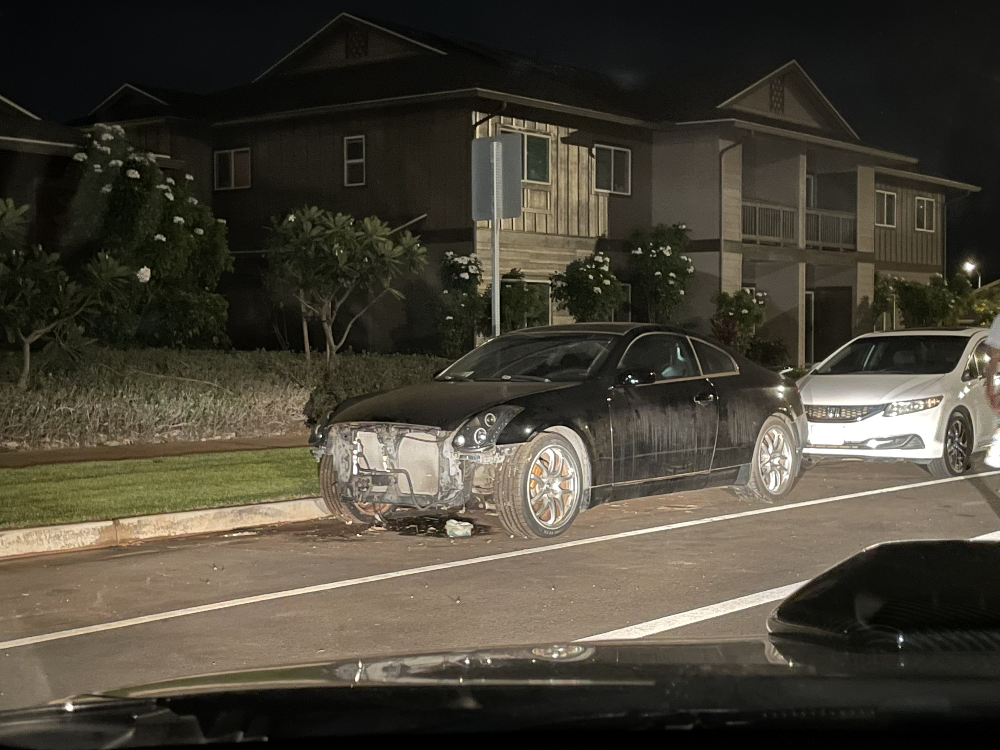
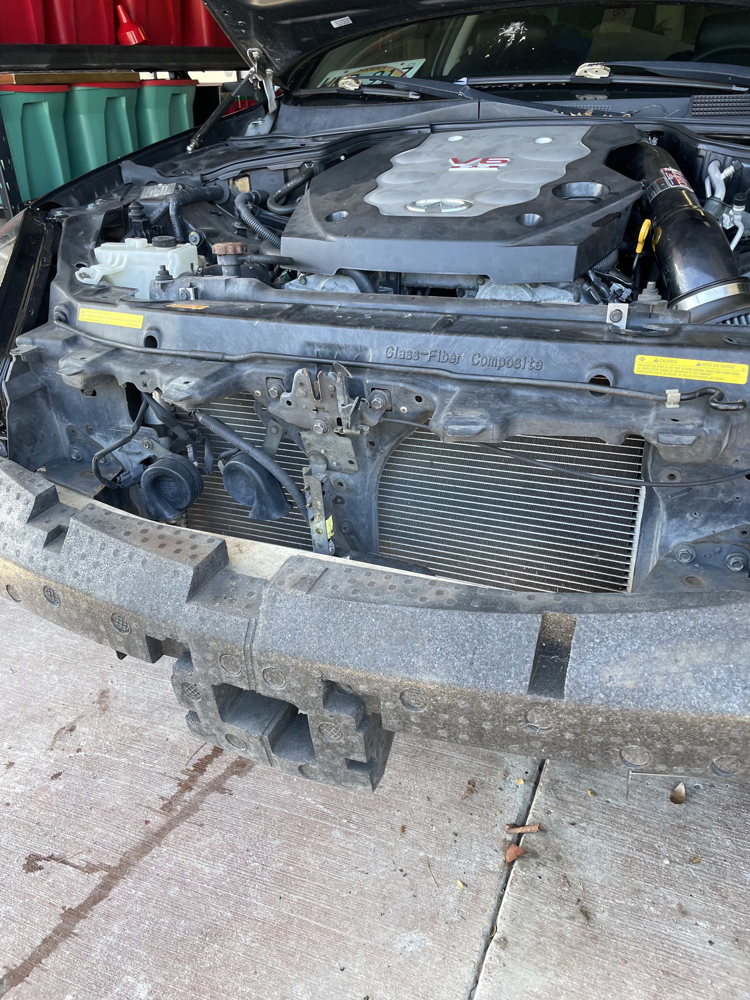

  
  
  

My interests in cars inspired to learn how the basics of a car work. I bought a broken car off of FaceBook Market place that didnt start or fully built so I dedicated myself to learn how to learn the ins and outs and got it to work again 

You can learn more at the [UH Micromouse News Announcement](https://manoa.hawaii.edu/news/article.php?aId=2857).
