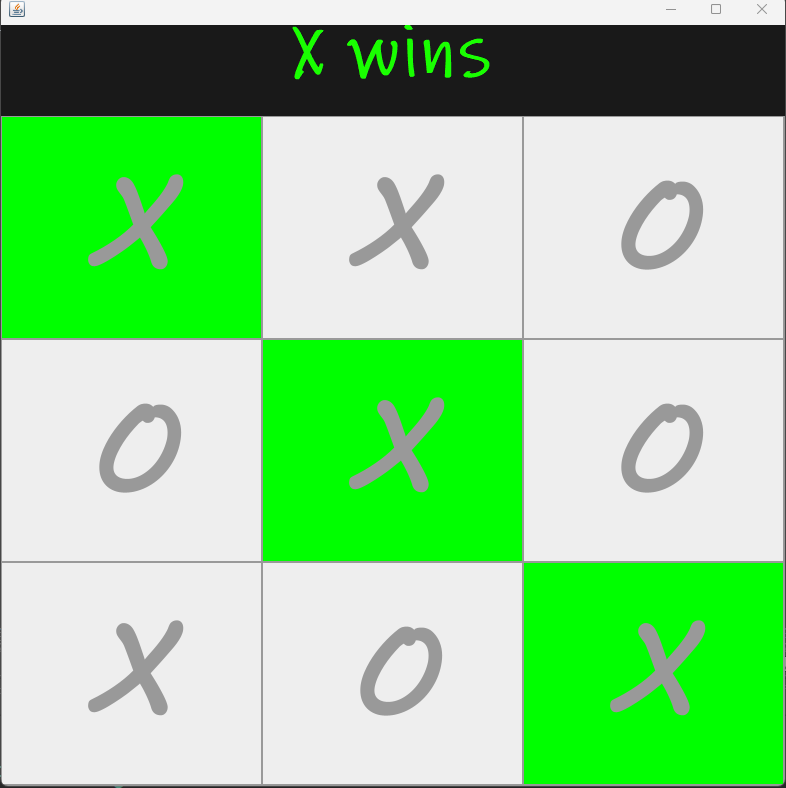

  
  
 

The TicTacToe program sets up a TicTacToe game board on a 3x3 grid. Each player gets a turn going, Player One's mark is an "X" while Player Two's mark is an "O". The first player to get 3 in a row with their mark wins. If no player wins it ends in a draw

## Learning Experience
When creating a TicTacToe game, I learned the importance of carefully designing the game logic to ensure a fair and enjoyable experience for the players. Establishing a clear structure for the game board, handling player turns, and implementing win conditions demanded meticulous attention to detail. Additionally, managing user input validation became a crucial aspect, ensuring that players could only make valid moves within the bounds of the grid. Understanding the dynamics of tracking the state of the game and determining a winner or a draw enhanced my problem-solving skills. Moreover, creating a visually appealing and user-friendly interface contributed to a more immersive gaming experience. Overall, developing a TicTacToe game provided insights into game development principles, logical reasoning, and user interaction, fostering a deeper understanding of programming concepts and the significance of user experience in application development.

## Example of the Code
Here is a little portion of the code: THat sets up the game board

public class TicTacToe implements ActionListener{

	Random random = new Random();
	JFrame frame = new JFrame();
	JPanel title_panel = new JPanel();
	JPanel button_panel = new JPanel();
	JLabel textfield = new JLabel();
	JButton[] buttons = new JButton[9];
	boolean player1_turn;

	TicTacToe(){
		
		frame.setDefaultCloseOperation(JFrame.EXIT_ON_CLOSE);
		frame.setSize(800,800);
		frame.getContentPane().setBackground(new Color(50,50,50));
		frame.setLayout(new BorderLayout());
		frame.setVisible(true);
		
		textfield.setBackground(new Color(25,25,25));
		textfield.setForeground(new Color(25,255,0));
		textfield.setFont(new Font("Ink Free",Font.BOLD,75));
		textfield.setHorizontalAlignment(JLabel.CENTER);
		textfield.setText("Tic-Tac-Toe");
		textfield.setOpaque(true);
		
		title_panel.setLayout(new BorderLayout());
		title_panel.setBounds(0,0,800,100);
		
		button_panel.setLayout(new GridLayout(3,3));
		button_panel.setBackground(new Color(150,150,150));
		
		for(int i=0;i<9;i++) {
			buttons[i] = new JButton();
			button_panel.add(buttons[i]);
			buttons[i].setFont(new Font("MV Boli",Font.BOLD,120));
			buttons[i].setFocusable(false);
			buttons[i].addActionListener(this);
		}
		
		title_panel.add(textfield);
		frame.add(title_panel,BorderLayout.NORTH);
		frame.add(button_panel);
		
		firstTurn();
	}

