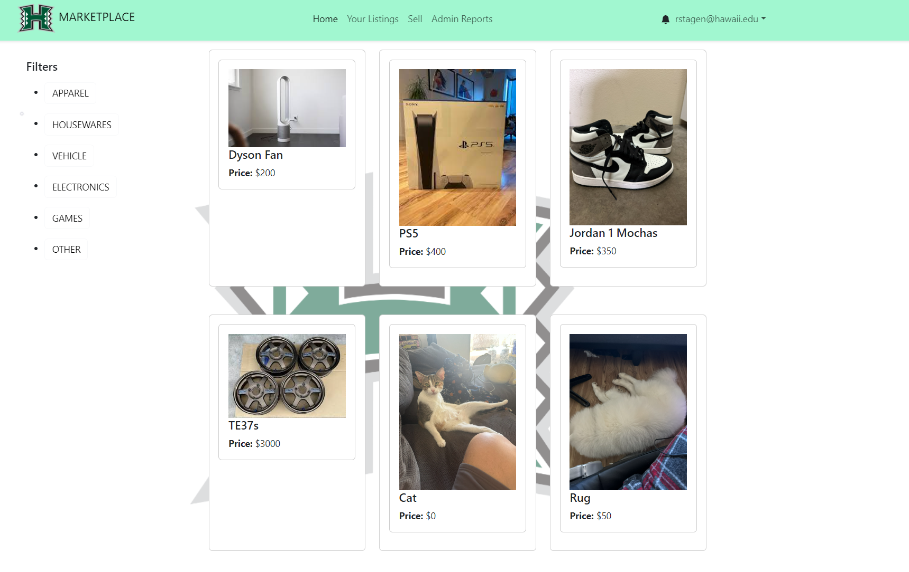
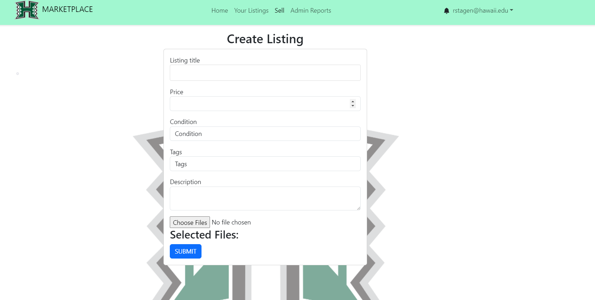

## Introduction 
We offer a way for students to buy/sell items. The marketplace is open for everyone to explore, allowing easy navigation through a search bar and a selection of pre-made filters. However, enhanced functionality becomes accessible when users log in as a “User” (specifically UHM students). As registered Users, individuals gain the ability to not only browse the marketplace but also delve into seller profiles, which display the user’s listed items and their respective ratings. Moreover, Users can take actions such as ordering, making offers, and purchasing goods directly from the marketplace. They can also create listings for items they wish to sell. Additionally, Users have the option to report other users or specific items on the marketplace that may violate guidelines. Administrators possess the authority to remove items from the marketplace if they are deemed unsafe, inappropriate, or illegal, ensuring a safe and reliable environment for all users.

 

### Contribution

In constructing the UH Marketplace, we designed our workflow and distributed tasks through GitHub project boards to amplify transparency and streamline collaboration. Our team, composed of dedicated members, ensured a balanced allocation of responsibilities, fostering a collaborative environment characterized by collective effort and mutual support.

My direct contributions to the UH Marketplace were diverse. I spearheaded the development of the robust 'My Listings' page, providing users with the ability to seamlessly view and edit the items they have posted. Additionally, I crafted filter buttons to enhance item search functionality, making it easier for users to locate what they need. Moreover, I designed visually appealing item cards displayed on both the 'My Listings' and 'Home Page,' adding a layer of organization and aesthetic finesse to the overall user experience.

 

## End
Then comes the next problem, the car was overheating. So I went back to do more research and discovered that coolant is leaking from the car. With a little bit of looking I concluded it came from the waterpump. After removing the water pump I saw that it was corroded and coolant was leaking through the O-rings and that concluded the overheating problem. Up next was the exterior portion, I zip tied all the wires together to hold the in place and ordered a OEM front bumper and finally with alot of money spent extendive research I finally got the car in a good working condition.

  

