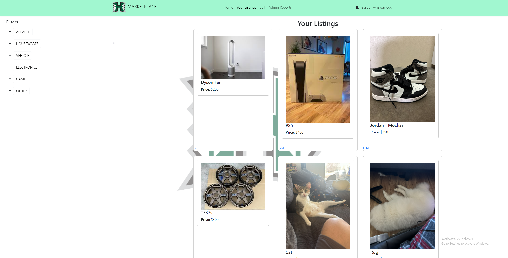
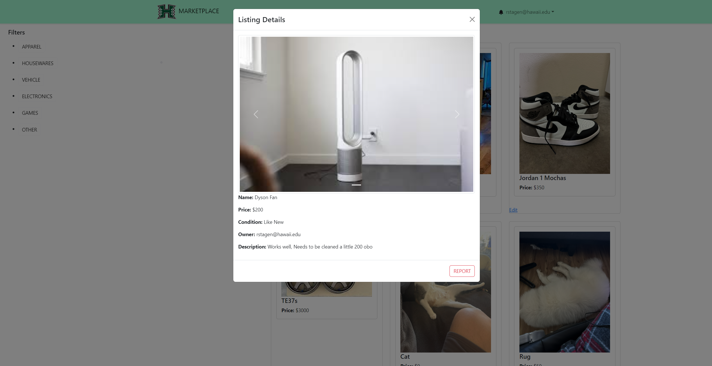

### Introduction 
We offer a way for students to buy/sell items. The marketplace is open for everyone to explore, allowing easy navigation through a search bar and a selection of pre-made filters. However, enhanced functionality becomes accessible when users log in as a “User” (specifically UHM students). As registered Users, individuals gain the ability to not only browse the marketplace but also delve into seller profiles, which display the user’s listed items and their respective ratings. Moreover, Users can take actions such as ordering, making offers, and purchasing goods directly from the marketplace. They can also create listings for items they wish to sell. Additionally, Users have the option to report other users or specific items on the marketplace that may violate guidelines. Administrators possess the authority to remove items from the marketplace if they are deemed unsafe, inappropriate, or illegal, ensuring a safe and reliable environment for all users.

 

### Contribution

In constructing the UH Marketplace, we designed our workflow and distributed tasks through GitHub project boards to amplify transparency and streamline collaboration. Our team, composed of dedicated members, ensured a balanced allocation of responsibilities, fostering a collaborative environment characterized by collective effort and mutual support.

My direct contributions to the UH Marketplace were diverse. I spearheaded the development of the robust 'My Listings' page, providing users with the ability to seamlessly view and edit the items they have posted. Additionally, I crafted filter buttons to enhance item search functionality, making it easier for users to locate what they need. Moreover, I designed visually appealing item cards displayed on both the 'My Listings' and 'Home Page,' adding a layer of organization and aesthetic finesse to the overall user experience.

 

I bettered the user experience by adding a feature  that pulls up another window to view the items details such as ListintgTitle, Price, Owner, Description, and Condition. 

 

### Reflecting on the Learning Journey

The hands-on experience of crafting the UH Marketplace proved to be a multifaceted and enriching journey. It not only sharpened my technical skills in web development but also deepened my understanding of the intricate planning and meticulous execution required for building a user-centered digital platform. This project extended beyond mere coding, refining my leadership, initiative, and communication abilities, highlighting the diverse aspects of software engineering. It served as a tangible application of theoretical knowledge, illustrating the convergence of technology and community service.

### Conclusion

In conclusion, the UH Marketplace transcends being just a project; it stands as a testament to the transformative potential of collaborative learning and the practical application of academic knowledge to address real-world challenges. It mirrors our dedication to improving the student experience through technology, and I take pride in my contribution to this meaningful endeavor.

[Organization and Source Code: UH Marketplace](https://github.com/the-manoa-marketplace)
[Home Page](https://the-manoa-marketplace.github.io/uh-marketplace.github.io/)
