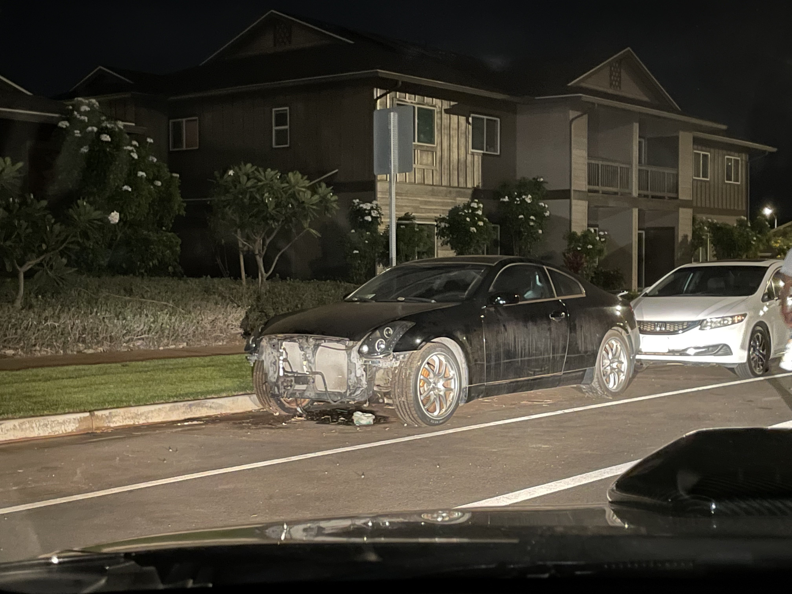

 

## Start
My interests in cars inspired to learn how a car is built. I bought a broken car off of FaceBook Market place that didnt start or wasn't fully built so I dedicated myself to learn how to learn the ins and outs of the car. In the very beginning I decided to look up the main things a car needs to start. In order for a car to start you need fuel, spark, timing, air, and compression. Starting from the cheapest to the most expensive parts I started with the air filter --> spark plugs --> fuel pump --> battery --> alternator --> starter. None of those options worked so then I looked into the electrical side of the car (the basic parts) I learned how to check the fuses battery terminal connections and the relays. With some research and timing I found the solution, it was the starter relay. 

   

## End
Then comes the next problem, the car was overheating. So I went back to do more research and discovered that coolant is leaking from the car. With a little bit of looking I concluded it came from the waterpump. After removing the water pump I saw that it was corroded and coolant was leaking through the O-rings and that concluded the overheating problem. Up next was the exterior portion, I zip tied all the wires together to hold the in place and ordered a OEM front bumper and finally with alot of money spent extendive research I finally got the car in a good working condition.

  

